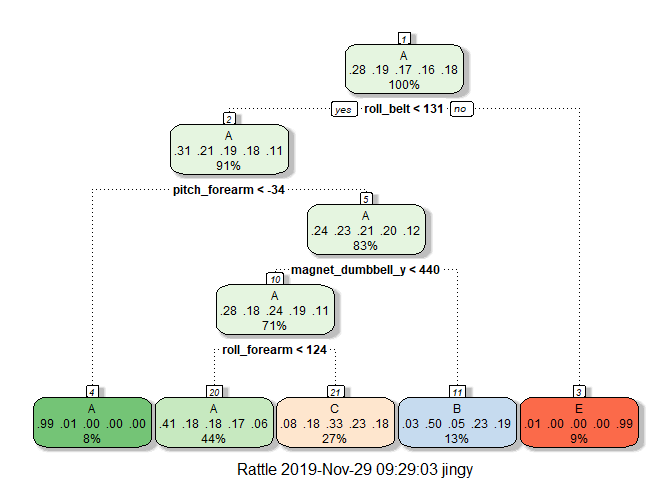
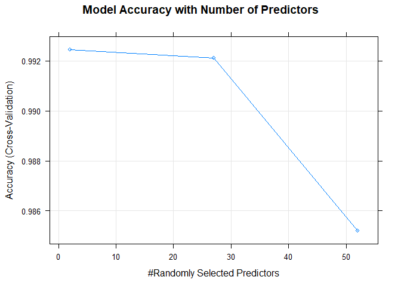

# Introduction
Using devices such as Jawbone Up, Nike FuelBand, and Fitbit it is now possible to collect a large amount of data about personal activity relatively inexpensively. These type of devices are part of the quantified self movement – a group of enthusiasts who take measurements about themselves regularly to improve their health, to find patterns in their behavior, or because they are tech geeks. One thing that people regularly do is quantify how much of a particular activity they do, but they rarely quantify how well they do it. 

In this project, data from accelerometers on the belt, forearm, arm, and dumbell of 6 participants are used. They were asked to perform barbell lifts correctly and incorrectly in 5 different ways. More information is available from the website here: http://groupware.les.inf.puc-rio.br/har (see the section on the Weight Lifting Exercise Dataset).

The training data for this project are available here:
https://d396qusza40orc.cloudfront.net/predmachlearn/pml-training.csv

The test data are available here:
https://d396qusza40orc.cloudfront.net/predmachlearn/pml-testing.csv

3 different prediction models, classification tree, random forest and gradien boosting method are performed to identify the most accurate and low sample error method in predicting the "classe" variable.

# Libraries

```r
library(ggplot2)
library(caret)
```

```
## Loading required package: lattice
```

```r
library(rpart)
library(gbm)
```

```
## Loaded gbm 2.1.5
```

```r
library(randomForest)
```

```
## randomForest 4.6-14
```

```
## Type rfNews() to see new features/changes/bug fixes.
```

```
## 
## Attaching package: 'randomForest'
```

```
## The following object is masked from 'package:ggplot2':
## 
##     margin
```

```r
library(rattle)
```

```
## Rattle: A free graphical interface for data science with R.
## Version 5.2.0 Copyright (c) 2006-2018 Togaware Pty Ltd.
## Type 'rattle()' to shake, rattle, and roll your data.
```

```
## 
## Attaching package: 'rattle'
```

```
## The following object is masked from 'package:randomForest':
## 
##     importance
```

# Load Data

```r
pml_training <- read.csv('./pml-training.csv',header = TRUE)
pml_testing <- read.csv('./pml-testing.csv',header = TRUE)
```

# Exploratory Data

```r
dim(pml_training)
```

```
## [1] 19622   160
```

```r
str(pml_training)
```

```
## 'data.frame':	19622 obs. of  160 variables:
##  $ X                       : int  1 2 3 4 5 6 7 8 9 10 ...
##  $ user_name               : Factor w/ 6 levels "adelmo","carlitos",..: 2 2 2 2 2 2 2 2 2 2 ...
##  $ raw_timestamp_part_1    : int  1323084231 1323084231 1323084231 1323084232 1323084232 1323084232 1323084232 1323084232 1323084232 1323084232 ...
##  $ raw_timestamp_part_2    : int  788290 808298 820366 120339 196328 304277 368296 440390 484323 484434 ...
##  $ cvtd_timestamp          : Factor w/ 20 levels "02/12/2011 13:32",..: 9 9 9 9 9 9 9 9 9 9 ...
##  $ new_window              : Factor w/ 2 levels "no","yes": 1 1 1 1 1 1 1 1 1 1 ...
##  $ num_window              : int  11 11 11 12 12 12 12 12 12 12 ...
##  $ roll_belt               : num  1.41 1.41 1.42 1.48 1.48 1.45 1.42 1.42 1.43 1.45 ...
##  $ pitch_belt              : num  8.07 8.07 8.07 8.05 8.07 8.06 8.09 8.13 8.16 8.17 ...
##  $ yaw_belt                : num  -94.4 -94.4 -94.4 -94.4 -94.4 -94.4 -94.4 -94.4 -94.4 -94.4 ...
##  $ total_accel_belt        : int  3 3 3 3 3 3 3 3 3 3 ...
##  $ kurtosis_roll_belt      : Factor w/ 397 levels "","-0.016850",..: 1 1 1 1 1 1 1 1 1 1 ...
##  $ kurtosis_picth_belt     : Factor w/ 317 levels "","-0.021887",..: 1 1 1 1 1 1 1 1 1 1 ...
##  $ kurtosis_yaw_belt       : Factor w/ 2 levels "","#DIV/0!": 1 1 1 1 1 1 1 1 1 1 ...
##  $ skewness_roll_belt      : Factor w/ 395 levels "","-0.003095",..: 1 1 1 1 1 1 1 1 1 1 ...
##  $ skewness_roll_belt.1    : Factor w/ 338 levels "","-0.005928",..: 1 1 1 1 1 1 1 1 1 1 ...
##  $ skewness_yaw_belt       : Factor w/ 2 levels "","#DIV/0!": 1 1 1 1 1 1 1 1 1 1 ...
##  $ max_roll_belt           : num  NA NA NA NA NA NA NA NA NA NA ...
##  $ max_picth_belt          : int  NA NA NA NA NA NA NA NA NA NA ...
##  $ max_yaw_belt            : Factor w/ 68 levels "","-0.1","-0.2",..: 1 1 1 1 1 1 1 1 1 1 ...
##  $ min_roll_belt           : num  NA NA NA NA NA NA NA NA NA NA ...
##  $ min_pitch_belt          : int  NA NA NA NA NA NA NA NA NA NA ...
##  $ min_yaw_belt            : Factor w/ 68 levels "","-0.1","-0.2",..: 1 1 1 1 1 1 1 1 1 1 ...
##  $ amplitude_roll_belt     : num  NA NA NA NA NA NA NA NA NA NA ...
##  $ amplitude_pitch_belt    : int  NA NA NA NA NA NA NA NA NA NA ...
##  $ amplitude_yaw_belt      : Factor w/ 4 levels "","#DIV/0!","0.00",..: 1 1 1 1 1 1 1 1 1 1 ...
##  $ var_total_accel_belt    : num  NA NA NA NA NA NA NA NA NA NA ...
##  $ avg_roll_belt           : num  NA NA NA NA NA NA NA NA NA NA ...
##  $ stddev_roll_belt        : num  NA NA NA NA NA NA NA NA NA NA ...
##  $ var_roll_belt           : num  NA NA NA NA NA NA NA NA NA NA ...
##  $ avg_pitch_belt          : num  NA NA NA NA NA NA NA NA NA NA ...
##  $ stddev_pitch_belt       : num  NA NA NA NA NA NA NA NA NA NA ...
##  $ var_pitch_belt          : num  NA NA NA NA NA NA NA NA NA NA ...
##  $ avg_yaw_belt            : num  NA NA NA NA NA NA NA NA NA NA ...
##  $ stddev_yaw_belt         : num  NA NA NA NA NA NA NA NA NA NA ...
##  $ var_yaw_belt            : num  NA NA NA NA NA NA NA NA NA NA ...
##  $ gyros_belt_x            : num  0 0.02 0 0.02 0.02 0.02 0.02 0.02 0.02 0.03 ...
##  $ gyros_belt_y            : num  0 0 0 0 0.02 0 0 0 0 0 ...
##  $ gyros_belt_z            : num  -0.02 -0.02 -0.02 -0.03 -0.02 -0.02 -0.02 -0.02 -0.02 0 ...
##  $ accel_belt_x            : int  -21 -22 -20 -22 -21 -21 -22 -22 -20 -21 ...
##  $ accel_belt_y            : int  4 4 5 3 2 4 3 4 2 4 ...
##  $ accel_belt_z            : int  22 22 23 21 24 21 21 21 24 22 ...
##  $ magnet_belt_x           : int  -3 -7 -2 -6 -6 0 -4 -2 1 -3 ...
##  $ magnet_belt_y           : int  599 608 600 604 600 603 599 603 602 609 ...
##  $ magnet_belt_z           : int  -313 -311 -305 -310 -302 -312 -311 -313 -312 -308 ...
##  $ roll_arm                : num  -128 -128 -128 -128 -128 -128 -128 -128 -128 -128 ...
##  $ pitch_arm               : num  22.5 22.5 22.5 22.1 22.1 22 21.9 21.8 21.7 21.6 ...
##  $ yaw_arm                 : num  -161 -161 -161 -161 -161 -161 -161 -161 -161 -161 ...
##  $ total_accel_arm         : int  34 34 34 34 34 34 34 34 34 34 ...
##  $ var_accel_arm           : num  NA NA NA NA NA NA NA NA NA NA ...
##  $ avg_roll_arm            : num  NA NA NA NA NA NA NA NA NA NA ...
##  $ stddev_roll_arm         : num  NA NA NA NA NA NA NA NA NA NA ...
##  $ var_roll_arm            : num  NA NA NA NA NA NA NA NA NA NA ...
##  $ avg_pitch_arm           : num  NA NA NA NA NA NA NA NA NA NA ...
##  $ stddev_pitch_arm        : num  NA NA NA NA NA NA NA NA NA NA ...
##  $ var_pitch_arm           : num  NA NA NA NA NA NA NA NA NA NA ...
##  $ avg_yaw_arm             : num  NA NA NA NA NA NA NA NA NA NA ...
##  $ stddev_yaw_arm          : num  NA NA NA NA NA NA NA NA NA NA ...
##  $ var_yaw_arm             : num  NA NA NA NA NA NA NA NA NA NA ...
##  $ gyros_arm_x             : num  0 0.02 0.02 0.02 0 0.02 0 0.02 0.02 0.02 ...
##  $ gyros_arm_y             : num  0 -0.02 -0.02 -0.03 -0.03 -0.03 -0.03 -0.02 -0.03 -0.03 ...
##  $ gyros_arm_z             : num  -0.02 -0.02 -0.02 0.02 0 0 0 0 -0.02 -0.02 ...
##  $ accel_arm_x             : int  -288 -290 -289 -289 -289 -289 -289 -289 -288 -288 ...
##  $ accel_arm_y             : int  109 110 110 111 111 111 111 111 109 110 ...
##  $ accel_arm_z             : int  -123 -125 -126 -123 -123 -122 -125 -124 -122 -124 ...
##  $ magnet_arm_x            : int  -368 -369 -368 -372 -374 -369 -373 -372 -369 -376 ...
##  $ magnet_arm_y            : int  337 337 344 344 337 342 336 338 341 334 ...
##  $ magnet_arm_z            : int  516 513 513 512 506 513 509 510 518 516 ...
##  $ kurtosis_roll_arm       : Factor w/ 330 levels "","-0.02438",..: 1 1 1 1 1 1 1 1 1 1 ...
##  $ kurtosis_picth_arm      : Factor w/ 328 levels "","-0.00484",..: 1 1 1 1 1 1 1 1 1 1 ...
##  $ kurtosis_yaw_arm        : Factor w/ 395 levels "","-0.01548",..: 1 1 1 1 1 1 1 1 1 1 ...
##  $ skewness_roll_arm       : Factor w/ 331 levels "","-0.00051",..: 1 1 1 1 1 1 1 1 1 1 ...
##  $ skewness_pitch_arm      : Factor w/ 328 levels "","-0.00184",..: 1 1 1 1 1 1 1 1 1 1 ...
##  $ skewness_yaw_arm        : Factor w/ 395 levels "","-0.00311",..: 1 1 1 1 1 1 1 1 1 1 ...
##  $ max_roll_arm            : num  NA NA NA NA NA NA NA NA NA NA ...
##  $ max_picth_arm           : num  NA NA NA NA NA NA NA NA NA NA ...
##  $ max_yaw_arm             : int  NA NA NA NA NA NA NA NA NA NA ...
##  $ min_roll_arm            : num  NA NA NA NA NA NA NA NA NA NA ...
##  $ min_pitch_arm           : num  NA NA NA NA NA NA NA NA NA NA ...
##  $ min_yaw_arm             : int  NA NA NA NA NA NA NA NA NA NA ...
##  $ amplitude_roll_arm      : num  NA NA NA NA NA NA NA NA NA NA ...
##  $ amplitude_pitch_arm     : num  NA NA NA NA NA NA NA NA NA NA ...
##  $ amplitude_yaw_arm       : int  NA NA NA NA NA NA NA NA NA NA ...
##  $ roll_dumbbell           : num  13.1 13.1 12.9 13.4 13.4 ...
##  $ pitch_dumbbell          : num  -70.5 -70.6 -70.3 -70.4 -70.4 ...
##  $ yaw_dumbbell            : num  -84.9 -84.7 -85.1 -84.9 -84.9 ...
##  $ kurtosis_roll_dumbbell  : Factor w/ 398 levels "","-0.0035","-0.0073",..: 1 1 1 1 1 1 1 1 1 1 ...
##  $ kurtosis_picth_dumbbell : Factor w/ 401 levels "","-0.0163","-0.0233",..: 1 1 1 1 1 1 1 1 1 1 ...
##  $ kurtosis_yaw_dumbbell   : Factor w/ 2 levels "","#DIV/0!": 1 1 1 1 1 1 1 1 1 1 ...
##  $ skewness_roll_dumbbell  : Factor w/ 401 levels "","-0.0082","-0.0096",..: 1 1 1 1 1 1 1 1 1 1 ...
##  $ skewness_pitch_dumbbell : Factor w/ 402 levels "","-0.0053","-0.0084",..: 1 1 1 1 1 1 1 1 1 1 ...
##  $ skewness_yaw_dumbbell   : Factor w/ 2 levels "","#DIV/0!": 1 1 1 1 1 1 1 1 1 1 ...
##  $ max_roll_dumbbell       : num  NA NA NA NA NA NA NA NA NA NA ...
##  $ max_picth_dumbbell      : num  NA NA NA NA NA NA NA NA NA NA ...
##  $ max_yaw_dumbbell        : Factor w/ 73 levels "","-0.1","-0.2",..: 1 1 1 1 1 1 1 1 1 1 ...
##  $ min_roll_dumbbell       : num  NA NA NA NA NA NA NA NA NA NA ...
##  $ min_pitch_dumbbell      : num  NA NA NA NA NA NA NA NA NA NA ...
##  $ min_yaw_dumbbell        : Factor w/ 73 levels "","-0.1","-0.2",..: 1 1 1 1 1 1 1 1 1 1 ...
##  $ amplitude_roll_dumbbell : num  NA NA NA NA NA NA NA NA NA NA ...
##   [list output truncated]
```

```r
dim(pml_testing)
```

```
## [1]  20 160
```

```r
str(pml_testing)
```

```
## 'data.frame':	20 obs. of  160 variables:
##  $ X                       : int  1 2 3 4 5 6 7 8 9 10 ...
##  $ user_name               : Factor w/ 6 levels "adelmo","carlitos",..: 6 5 5 1 4 5 5 5 2 3 ...
##  $ raw_timestamp_part_1    : int  1323095002 1322673067 1322673075 1322832789 1322489635 1322673149 1322673128 1322673076 1323084240 1322837822 ...
##  $ raw_timestamp_part_2    : int  868349 778725 342967 560311 814776 510661 766645 54671 916313 384285 ...
##  $ cvtd_timestamp          : Factor w/ 11 levels "02/12/2011 13:33",..: 5 10 10 1 6 11 11 10 3 2 ...
##  $ new_window              : Factor w/ 1 level "no": 1 1 1 1 1 1 1 1 1 1 ...
##  $ num_window              : int  74 431 439 194 235 504 485 440 323 664 ...
##  $ roll_belt               : num  123 1.02 0.87 125 1.35 -5.92 1.2 0.43 0.93 114 ...
##  $ pitch_belt              : num  27 4.87 1.82 -41.6 3.33 1.59 4.44 4.15 6.72 22.4 ...
##  $ yaw_belt                : num  -4.75 -88.9 -88.5 162 -88.6 -87.7 -87.3 -88.5 -93.7 -13.1 ...
##  $ total_accel_belt        : int  20 4 5 17 3 4 4 4 4 18 ...
##  $ kurtosis_roll_belt      : logi  NA NA NA NA NA NA ...
##  $ kurtosis_picth_belt     : logi  NA NA NA NA NA NA ...
##  $ kurtosis_yaw_belt       : logi  NA NA NA NA NA NA ...
##  $ skewness_roll_belt      : logi  NA NA NA NA NA NA ...
##  $ skewness_roll_belt.1    : logi  NA NA NA NA NA NA ...
##  $ skewness_yaw_belt       : logi  NA NA NA NA NA NA ...
##  $ max_roll_belt           : logi  NA NA NA NA NA NA ...
##  $ max_picth_belt          : logi  NA NA NA NA NA NA ...
##  $ max_yaw_belt            : logi  NA NA NA NA NA NA ...
##  $ min_roll_belt           : logi  NA NA NA NA NA NA ...
##  $ min_pitch_belt          : logi  NA NA NA NA NA NA ...
##  $ min_yaw_belt            : logi  NA NA NA NA NA NA ...
##  $ amplitude_roll_belt     : logi  NA NA NA NA NA NA ...
##  $ amplitude_pitch_belt    : logi  NA NA NA NA NA NA ...
##  $ amplitude_yaw_belt      : logi  NA NA NA NA NA NA ...
##  $ var_total_accel_belt    : logi  NA NA NA NA NA NA ...
##  $ avg_roll_belt           : logi  NA NA NA NA NA NA ...
##  $ stddev_roll_belt        : logi  NA NA NA NA NA NA ...
##  $ var_roll_belt           : logi  NA NA NA NA NA NA ...
##  $ avg_pitch_belt          : logi  NA NA NA NA NA NA ...
##  $ stddev_pitch_belt       : logi  NA NA NA NA NA NA ...
##  $ var_pitch_belt          : logi  NA NA NA NA NA NA ...
##  $ avg_yaw_belt            : logi  NA NA NA NA NA NA ...
##  $ stddev_yaw_belt         : logi  NA NA NA NA NA NA ...
##  $ var_yaw_belt            : logi  NA NA NA NA NA NA ...
##  $ gyros_belt_x            : num  -0.5 -0.06 0.05 0.11 0.03 0.1 -0.06 -0.18 0.1 0.14 ...
##  $ gyros_belt_y            : num  -0.02 -0.02 0.02 0.11 0.02 0.05 0 -0.02 0 0.11 ...
##  $ gyros_belt_z            : num  -0.46 -0.07 0.03 -0.16 0 -0.13 0 -0.03 -0.02 -0.16 ...
##  $ accel_belt_x            : int  -38 -13 1 46 -8 -11 -14 -10 -15 -25 ...
##  $ accel_belt_y            : int  69 11 -1 45 4 -16 2 -2 1 63 ...
##  $ accel_belt_z            : int  -179 39 49 -156 27 38 35 42 32 -158 ...
##  $ magnet_belt_x           : int  -13 43 29 169 33 31 50 39 -6 10 ...
##  $ magnet_belt_y           : int  581 636 631 608 566 638 622 635 600 601 ...
##  $ magnet_belt_z           : int  -382 -309 -312 -304 -418 -291 -315 -305 -302 -330 ...
##  $ roll_arm                : num  40.7 0 0 -109 76.1 0 0 0 -137 -82.4 ...
##  $ pitch_arm               : num  -27.8 0 0 55 2.76 0 0 0 11.2 -63.8 ...
##  $ yaw_arm                 : num  178 0 0 -142 102 0 0 0 -167 -75.3 ...
##  $ total_accel_arm         : int  10 38 44 25 29 14 15 22 34 32 ...
##  $ var_accel_arm           : logi  NA NA NA NA NA NA ...
##  $ avg_roll_arm            : logi  NA NA NA NA NA NA ...
##  $ stddev_roll_arm         : logi  NA NA NA NA NA NA ...
##  $ var_roll_arm            : logi  NA NA NA NA NA NA ...
##  $ avg_pitch_arm           : logi  NA NA NA NA NA NA ...
##  $ stddev_pitch_arm        : logi  NA NA NA NA NA NA ...
##  $ var_pitch_arm           : logi  NA NA NA NA NA NA ...
##  $ avg_yaw_arm             : logi  NA NA NA NA NA NA ...
##  $ stddev_yaw_arm          : logi  NA NA NA NA NA NA ...
##  $ var_yaw_arm             : logi  NA NA NA NA NA NA ...
##  $ gyros_arm_x             : num  -1.65 -1.17 2.1 0.22 -1.96 0.02 2.36 -3.71 0.03 0.26 ...
##  $ gyros_arm_y             : num  0.48 0.85 -1.36 -0.51 0.79 0.05 -1.01 1.85 -0.02 -0.5 ...
##  $ gyros_arm_z             : num  -0.18 -0.43 1.13 0.92 -0.54 -0.07 0.89 -0.69 -0.02 0.79 ...
##  $ accel_arm_x             : int  16 -290 -341 -238 -197 -26 99 -98 -287 -301 ...
##  $ accel_arm_y             : int  38 215 245 -57 200 130 79 175 111 -42 ...
##  $ accel_arm_z             : int  93 -90 -87 6 -30 -19 -67 -78 -122 -80 ...
##  $ magnet_arm_x            : int  -326 -325 -264 -173 -170 396 702 535 -367 -420 ...
##  $ magnet_arm_y            : int  385 447 474 257 275 176 15 215 335 294 ...
##  $ magnet_arm_z            : int  481 434 413 633 617 516 217 385 520 493 ...
##  $ kurtosis_roll_arm       : logi  NA NA NA NA NA NA ...
##  $ kurtosis_picth_arm      : logi  NA NA NA NA NA NA ...
##  $ kurtosis_yaw_arm        : logi  NA NA NA NA NA NA ...
##  $ skewness_roll_arm       : logi  NA NA NA NA NA NA ...
##  $ skewness_pitch_arm      : logi  NA NA NA NA NA NA ...
##  $ skewness_yaw_arm        : logi  NA NA NA NA NA NA ...
##  $ max_roll_arm            : logi  NA NA NA NA NA NA ...
##  $ max_picth_arm           : logi  NA NA NA NA NA NA ...
##  $ max_yaw_arm             : logi  NA NA NA NA NA NA ...
##  $ min_roll_arm            : logi  NA NA NA NA NA NA ...
##  $ min_pitch_arm           : logi  NA NA NA NA NA NA ...
##  $ min_yaw_arm             : logi  NA NA NA NA NA NA ...
##  $ amplitude_roll_arm      : logi  NA NA NA NA NA NA ...
##  $ amplitude_pitch_arm     : logi  NA NA NA NA NA NA ...
##  $ amplitude_yaw_arm       : logi  NA NA NA NA NA NA ...
##  $ roll_dumbbell           : num  -17.7 54.5 57.1 43.1 -101.4 ...
##  $ pitch_dumbbell          : num  25 -53.7 -51.4 -30 -53.4 ...
##  $ yaw_dumbbell            : num  126.2 -75.5 -75.2 -103.3 -14.2 ...
##  $ kurtosis_roll_dumbbell  : logi  NA NA NA NA NA NA ...
##  $ kurtosis_picth_dumbbell : logi  NA NA NA NA NA NA ...
##  $ kurtosis_yaw_dumbbell   : logi  NA NA NA NA NA NA ...
##  $ skewness_roll_dumbbell  : logi  NA NA NA NA NA NA ...
##  $ skewness_pitch_dumbbell : logi  NA NA NA NA NA NA ...
##  $ skewness_yaw_dumbbell   : logi  NA NA NA NA NA NA ...
##  $ max_roll_dumbbell       : logi  NA NA NA NA NA NA ...
##  $ max_picth_dumbbell      : logi  NA NA NA NA NA NA ...
##  $ max_yaw_dumbbell        : logi  NA NA NA NA NA NA ...
##  $ min_roll_dumbbell       : logi  NA NA NA NA NA NA ...
##  $ min_pitch_dumbbell      : logi  NA NA NA NA NA NA ...
##  $ min_yaw_dumbbell        : logi  NA NA NA NA NA NA ...
##  $ amplitude_roll_dumbbell : logi  NA NA NA NA NA NA ...
##   [list output truncated]
```

After exploring the data, we found there are some variables with value NA and the first 7 columns are meaningless to the outcome.

# Data Cleaning

```r
training_col_na <- which(colSums(is.na(pml_training)|pml_training=="") > 0.9*dim(pml_training)[1])  #select columns with null or blank value which more than 90% of the observation
pml_training_cln <- pml_training[,-training_col_na]   #remove columns with NA
pml_training_cln <- pml_training_cln[,-c(1:7)]        #remove first 7 columns
dim(pml_training_cln)
```

```
## [1] 19622    53
```


```r
testing_col_na <- which(colSums(is.na(pml_testing)|pml_testing=="") > 0.9*dim(pml_testing)[1])
pml_testing_cln <- pml_testing[,-testing_col_na]
pml_testing_cln <- pml_testing_cln[,-c(1:7)]
dim(pml_testing_cln)
```

```
## [1] 20 53
```

Both training and testing data left 53 variables from 160 variables.

# Data Preparation for Training Data

```r
set.seed(789)
partition_data <- createDataPartition(pml_training_cln$classe,p=0.75)[[1]]  #split the training data by 75%
train_data <- pml_training_cln[partition_data,]
test_data <- pml_training_cln[-partition_data,]
```

# Model Building
In this project, we will use 3 models to predict the outcome:
*1. Classification Tree
*2. Random Forest
*3. Gradient Boosting Method

All models will using Cross-validated method for resampling.

# Model 1 - Classification Tree

```r
model_ct <- train(classe~., data=train_data, method="rpart", trControl=trainControl(method = "cv", number = 5))
model_ct
```

```
## CART 
## 
## 14718 samples
##    52 predictor
##     5 classes: 'A', 'B', 'C', 'D', 'E' 
## 
## No pre-processing
## Resampling: Cross-Validated (5 fold) 
## Summary of sample sizes: 11774, 11774, 11775, 11775, 11774 
## Resampling results across tuning parameters:
## 
##   cp          Accuracy   Kappa     
##   0.03617203  0.5110752  0.36063230
##   0.05978037  0.3927131  0.16887159
##   0.11658597  0.3157371  0.04783159
## 
## Accuracy was used to select the optimal model using the largest value.
## The final value used for the model was cp = 0.03617203.
```

```r
fancyRpartPlot(model_ct$finalModel)
```

<!-- -->

```r
pred_ct <- predict(model_ct, newdata = test_data)
confusionMatrix(test_data$classe,pred_ct)
```

```
## Confusion Matrix and Statistics
## 
##           Reference
## Prediction    A    B    C    D    E
##          A 1263   26  104    0    2
##          B  394  342  213    0    0
##          C  411   18  426    0    0
##          D  361  143  300    0    0
##          E  139  124  247    0  391
## 
## Overall Statistics
##                                          
##                Accuracy : 0.4939         
##                  95% CI : (0.4798, 0.508)
##     No Information Rate : 0.5237         
##     P-Value [Acc > NIR] : 1              
##                                          
##                   Kappa : 0.3381         
##                                          
##  Mcnemar's Test P-Value : NA             
## 
## Statistics by Class:
## 
##                      Class: A Class: B Class: C Class: D Class: E
## Sensitivity            0.4918  0.52374  0.33023       NA  0.99491
## Specificity            0.9435  0.85721  0.88129   0.8361  0.88694
## Pos Pred Value         0.9054  0.36038  0.49825       NA  0.43396
## Neg Pred Value         0.6281  0.92137  0.78661       NA  0.99950
## Prevalence             0.5237  0.13316  0.26305   0.0000  0.08014
## Detection Rate         0.2575  0.06974  0.08687   0.0000  0.07973
## Detection Prevalence   0.2845  0.19352  0.17435   0.1639  0.18373
## Balanced Accuracy      0.7177  0.69047  0.60576       NA  0.94093
```

From the result shows the accuracy is only 48.95% which has very high of sample error about 51%. This showing the model cannot predict the outcome very well.

# Model 2 - Random Forest

```r
model_rf <- train(classe~., data=train_data, method="rf", trControl=trainControl(method = "cv", number = 5))
model_rf
```

```
## Random Forest 
## 
## 14718 samples
##    52 predictor
##     5 classes: 'A', 'B', 'C', 'D', 'E' 
## 
## No pre-processing
## Resampling: Cross-Validated (5 fold) 
## Summary of sample sizes: 11775, 11774, 11775, 11773, 11775 
## Resampling results across tuning parameters:
## 
##   mtry  Accuracy   Kappa    
##    2    0.9924580  0.9904594
##   27    0.9921184  0.9900290
##   52    0.9851884  0.9812609
## 
## Accuracy was used to select the optimal model using the largest value.
## The final value used for the model was mtry = 2.
```

```r
pred_rf <- predict(model_rf, newdata = test_data)
confusionMatrix(test_data$classe,pred_rf)
```

```
## Confusion Matrix and Statistics
## 
##           Reference
## Prediction    A    B    C    D    E
##          A 1395    0    0    0    0
##          B    0  949    0    0    0
##          C    0    5  850    0    0
##          D    0    0   12  789    3
##          E    0    0    0    1  900
## 
## Overall Statistics
##                                           
##                Accuracy : 0.9957          
##                  95% CI : (0.9935, 0.9973)
##     No Information Rate : 0.2845          
##     P-Value [Acc > NIR] : < 2.2e-16       
##                                           
##                   Kappa : 0.9946          
##                                           
##  Mcnemar's Test P-Value : NA              
## 
## Statistics by Class:
## 
##                      Class: A Class: B Class: C Class: D Class: E
## Sensitivity            1.0000   0.9948   0.9861   0.9987   0.9967
## Specificity            1.0000   1.0000   0.9988   0.9964   0.9998
## Pos Pred Value         1.0000   1.0000   0.9942   0.9813   0.9989
## Neg Pred Value         1.0000   0.9987   0.9970   0.9998   0.9993
## Prevalence             0.2845   0.1945   0.1758   0.1611   0.1841
## Detection Rate         0.2845   0.1935   0.1733   0.1609   0.1835
## Detection Prevalence   0.2845   0.1935   0.1743   0.1639   0.1837
## Balanced Accuracy      1.0000   0.9974   0.9924   0.9975   0.9982
```

```r
plot(model_rf, main="Model Accuracy with Number of Predictors")
```

<!-- -->

By using Random Forest model, the accuracy is 99.57% which is has very small error. This showing the model is good for prediction. From the result can see that using 2 predictors and 27 predictors has small effect on the accuracy. 

# Model 3 - Gradient Boosting Method

```r
model_gbm <- train(classe~., data=train_data, method="gbm", trControl=trainControl(method = "cv", number = 5), verbose=FALSE)
model_gbm
```

```
## Stochastic Gradient Boosting 
## 
## 14718 samples
##    52 predictor
##     5 classes: 'A', 'B', 'C', 'D', 'E' 
## 
## No pre-processing
## Resampling: Cross-Validated (5 fold) 
## Summary of sample sizes: 11774, 11776, 11774, 11774, 11774 
## Resampling results across tuning parameters:
## 
##   interaction.depth  n.trees  Accuracy   Kappa    
##   1                   50      0.7526159  0.6861817
##   1                  100      0.8203563  0.7725927
##   1                  150      0.8552109  0.8167370
##   2                   50      0.8543270  0.8153971
##   2                  100      0.9054212  0.8802976
##   2                  150      0.9292692  0.9104814
##   3                   50      0.8959086  0.8682273
##   3                  100      0.9421107  0.9267445
##   3                  150      0.9614070  0.9511731
## 
## Tuning parameter 'shrinkage' was held constant at a value of 0.1
## 
## Tuning parameter 'n.minobsinnode' was held constant at a value of 10
## Accuracy was used to select the optimal model using the largest value.
## The final values used for the model were n.trees = 150, interaction.depth =
##  3, shrinkage = 0.1 and n.minobsinnode = 10.
```

```r
pred_gbm <- predict(model_gbm, newdata = test_data)
confusionMatrix(test_data$classe,pred_gbm)
```

```
## Confusion Matrix and Statistics
## 
##           Reference
## Prediction    A    B    C    D    E
##          A 1371   21    0    2    1
##          B   21  911   14    2    1
##          C    0   23  817   15    0
##          D    0    4   22  773    5
##          E    1   16   10   15  859
## 
## Overall Statistics
##                                           
##                Accuracy : 0.9647          
##                  95% CI : (0.9592, 0.9697)
##     No Information Rate : 0.2841          
##     P-Value [Acc > NIR] : < 2.2e-16       
##                                           
##                   Kappa : 0.9554          
##                                           
##  Mcnemar's Test P-Value : NA              
## 
## Statistics by Class:
## 
##                      Class: A Class: B Class: C Class: D Class: E
## Sensitivity            0.9842   0.9344   0.9467   0.9579   0.9919
## Specificity            0.9932   0.9903   0.9906   0.9924   0.9896
## Pos Pred Value         0.9828   0.9600   0.9556   0.9614   0.9534
## Neg Pred Value         0.9937   0.9838   0.9886   0.9917   0.9983
## Prevalence             0.2841   0.1988   0.1760   0.1646   0.1766
## Detection Rate         0.2796   0.1858   0.1666   0.1576   0.1752
## Detection Prevalence   0.2845   0.1935   0.1743   0.1639   0.1837
## Balanced Accuracy      0.9887   0.9623   0.9686   0.9752   0.9908
```

Third model we used is Gradient Boosting Model. This shows the accuracy is 96.47%, which is well for prediction.

# Conclusion

From the results of 3 models, we choose Random Forest Model as the best model for this data prediction. So, the prediction result as shown below:


```r
final_test <- predict(model_rf, newdata = pml_testing_cln)
final_test
```

```
##  [1] B A B A A E D B A A B C B A E E A B B B
## Levels: A B C D E
```

